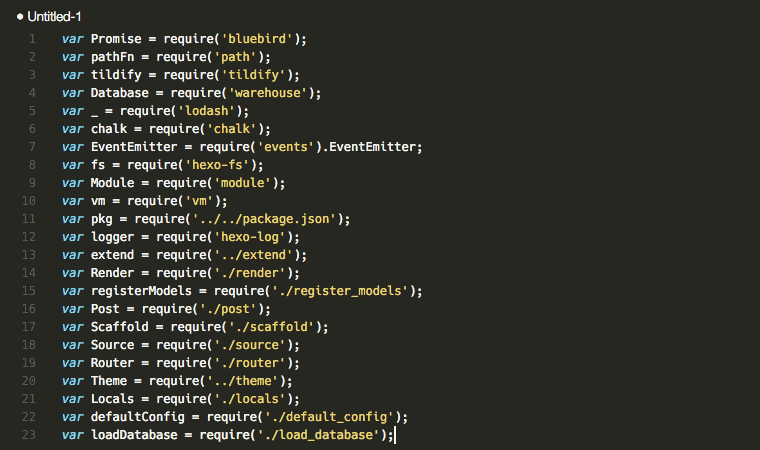

# Require sort

Visual Studio Code plugin for sorting selected JavaScript require() lines by module name.

## Installation

Run ``ext install require-sort`` in the command palette.

## Usage

Select lines containing the require statements you want to sort, then use either of:

- Command palette: Ctrl-Shift-P/Command-Shift-P → Sort requires
- Default key binding: Shift-Ctrl-R on Linux/Windows or Shift-Cmd-R on Mac

## Example

